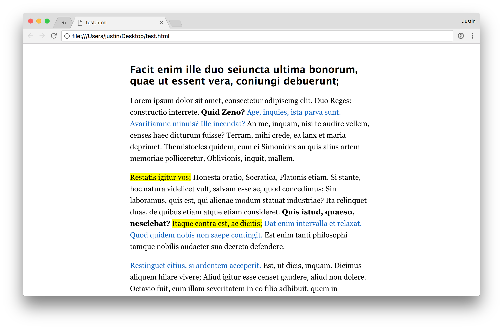
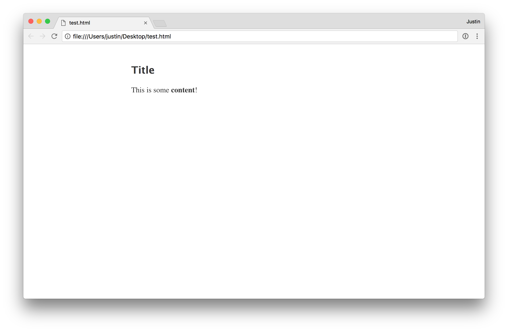

# content-clear

Clear, clean, readable content.

## Screenshots



## How to use

Simply use [build/style-min.css](build/style-min.css) in your HTML file. content-clear will automatically transform all `<article>`s.

Example schema:

```html
<html>
    <head>
        <!-- Include the CSS -->
    </head>
    <body>
        <article>
            <h1>Title</h1>
            <p>This is some <strong>content</strong>!</p>
        </article>
    </body>
</html>
```

Output:



## API usage

First, install from NPM:

```
npm i content-clear --save
```

Then, use it in your project:

```javascript
import contentClear from 'content-clear';

console.log(contentClear.location); // Output build location

contentClear.content().then(console.log); // Output built CSS
```